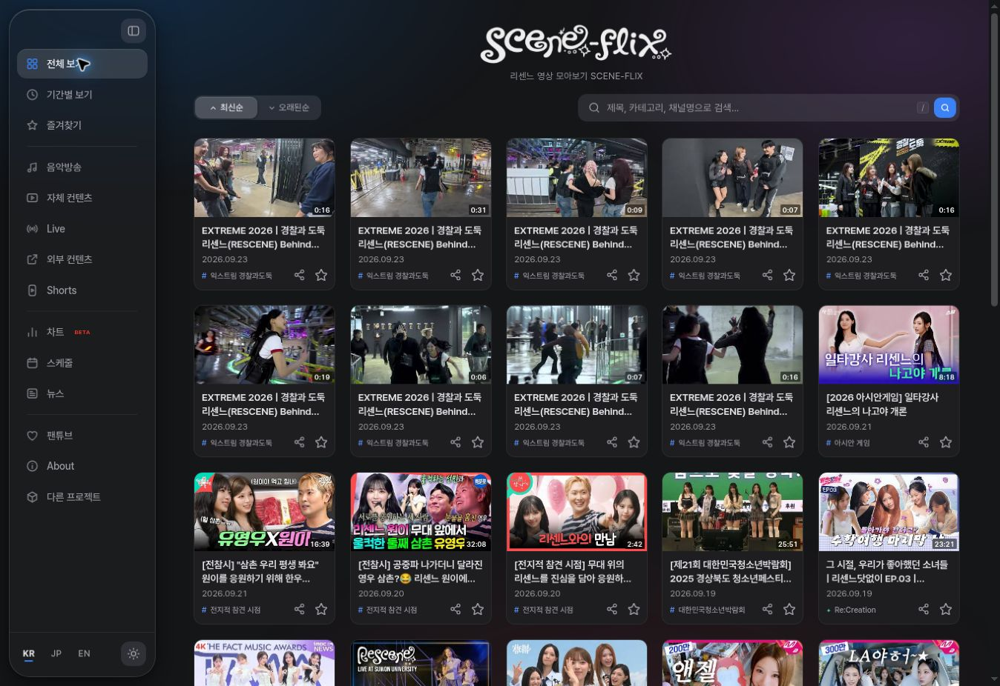
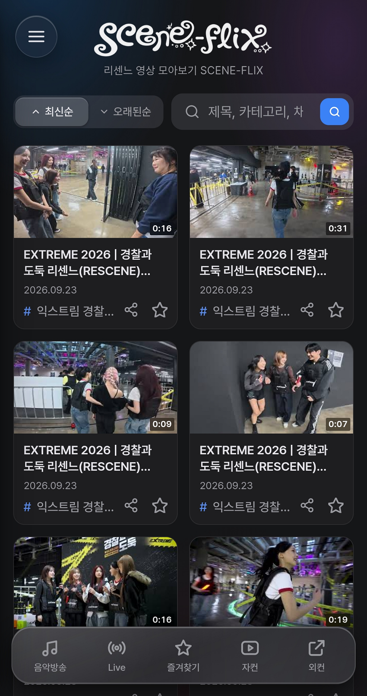

  
  
<strong>RESCENE의 영상과 활동 정보를 한곳에서.</strong>

  
리센느와 리마인을 위한 비공식 콘텐츠 아카이브

  
<a href="https://adam-yam.github.io/SCENE-FLIX/">SCENE-FLIX 바로가기 ↗</a>

## 프로젝트 소개

**SCENE-FLIX**는 RESCENE(리센느)의 영상 콘텐츠와 활동 정보를 통합해 제공하는 비공식 팬메이드 웹 아카이브입니다. 여러 채널에 분산된 음악방송, 자체 콘텐츠, 라이브, 외부 출연 영상과 Shorts를 분류하여 원하는 콘텐츠를 편리하게 탐색할 수 있도록 구성했습니다.

영상 아카이브와 함께 스케줄, 뉴스, 음원 차트, 팬튜브 채널 정보를 제공합니다. 별도의 프로그램 설치 없이 PC와 모바일 브라우저에서 이용할 수 있습니다.

## 주요 기능

| 기능 | 설명 |
| --- | --- |
| 영상 아카이브 | 음악방송, 자체 콘텐츠, Live, 외부 콘텐츠를 유형별로 분류하여 제공 |
| 검색 및 필터 | 검색어, 카테고리, 멤버를 기준으로 콘텐츠 탐색 |
| 즐겨찾기 및 재생목록 | 관심 영상을 저장하고 재생목록으로 감상 |
| Shorts | 공식 및 관련 채널의 Shorts를 세로형 인터페이스로 탐색 |
| 팬튜브 | 리마인이 운영하는 팬튜브 채널 소개 |
| 스케줄 및 뉴스 | 리센느의 활동 일정과 관련 기사 확인 |
| 음원 차트 | 음원 플랫폼별 순위와 순위 변동 정보 제공 |
| 반응형 인터페이스 | PC, 태블릿, 모바일 화면에 대응 |
| 다국어 및 PWA | 한국어·일본어·영어 인터페이스와 지원 브라우저의 홈 화면 추가 기능 제공 |

## 화면 미리보기

### PC

  

### 모바일

  

## 이용 안내

1. **[SCENE-FLIX](https://adam-yam.github.io/SCENE-FLIX/)**에 접속합니다.
2. 메뉴에서 콘텐츠 유형을 선택하고, 검색 및 필터로 원하는 영상을 탐색합니다.
3. 영상을 선택해 시청하거나 즐겨찾기에 저장합니다.

PWA를 지원하는 브라우저에서는 **홈 화면에 추가** 기능을 통해 앱과 유사한 방식으로 실행할 수 있습니다.

즐겨찾기는 이용 중인 브라우저의 로컬 저장소에 보관됩니다. 기기 또는 브라우저 간 자동 동기화는 지원하지 않으며, 사이트 데이터를 삭제하면 저장된 목록이 초기화될 수 있습니다.

## 기술 구성

프런트엔드는 HTML, CSS, JavaScript 기반의 정적 웹사이트로 구성되며, GitHub Pages를 통해 배포합니다. 스케줄, 뉴스, Shorts, 음원 차트는 Python 수집 스크립트와 GitHub Actions를 통해 갱신한 JSON 데이터를 사용합니다.

| 구분 | 사용 기술 |
| --- | --- |
| 프런트엔드 | HTML · CSS · Vanilla JavaScript |
| 데이터 | JSON |
| 데이터 수집 | Python |
| 워크플로우 실행 | GitHub Actions |
| 호스팅 | GitHub Pages |
| PWA | Web App Manifest · Service Worker |

### 디렉터리 구성

| 경로 | 용도 |
| --- | --- |
| `index.html` | 사용자 인터페이스 및 주요 기능 |
| `image/` | 로고, 아이콘 및 이미지 리소스 |
| `docs/images/` | README용 화면 스크린샷 |
| `data/` | 스케줄, 뉴스, Shorts 및 음원 차트 데이터 |
| `crawlers/` | 데이터 수집 스크립트 |
| `.github/workflows/` | 데이터 갱신 워크플로우 정의 |
| `manifest.json` · `service-worker.js` | PWA 구성 및 캐시 처리 |

  
데이터 갱신 및 환경 설정

### 워크플로우 실행

데이터 갱신 워크플로우는 수동 실행(`workflow_dispatch`) 방식으로 구성되어 있습니다. 저장소의 **Actions** 탭에서 해당 워크플로우를 선택한 후 **Run workflow**를 실행합니다. 수집 결과에 변경 사항이 있으면 갱신된 데이터를 저장소에 커밋합니다.

| 워크플로우 | 갱신 대상 | 사용하는 Repository Secrets |
| --- | --- | --- |
| `chart-crawl.yml` | 음원 차트 | 없음 |
| `crawl-shorts.yml` | 공식 채널 및 안원잘부 Shorts | `YOUTUBE_API_KEY` |
| `schedule.yml` | 스케줄 및 뉴스 | `YOUTUBE_API_KEY`, `NAVER_CLIENT_ID`, `NAVER_CLIENT_SECRET` |

### API 인증 정보

데이터 수집에 사용하는 API 인증 정보는 저장소의 **Settings → Secrets and variables → Actions**에 Repository Secrets로 등록합니다.

사이트에 표시되는 데이터는 각 수집 작업의 갱신 결과를 기준으로 하며, 원본 서비스의 최신 정보와 차이가 있을 수 있습니다.

## 문의 및 피드백

오류 제보, 콘텐츠 누락, 기능 제안, 콘텐츠 수정·삭제 요청은 **[sceneflix.may@gmail.com](mailto:sceneflix.may@gmail.com)**으로 전달해 주세요. 관련 페이지나 영상 주소와 구체적인 내용을 함께 보내주시면 확인에 도움이 됩니다.

## 운영 및 권리 안내

SCENE-FLIX는 RESCENE과 리마인을 위해 제작된 **비공식·비영리 팬메이드 프로젝트**입니다. 더뮤즈엔터테인먼트 및 RESCENE의 공식 서비스가 아니며, 광고 수익을 목적으로 운영하지 않습니다.

사이트에서 연결하거나 소개하는 영상, 이미지, 기사 등 콘텐츠의 저작권은 각 원저작자와 권리자에게 있습니다. 권리자의 요청이 있는 경우 관련 콘텐츠를 수정하거나 삭제할 수 있습니다.
