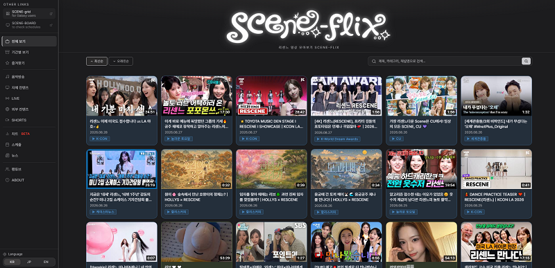
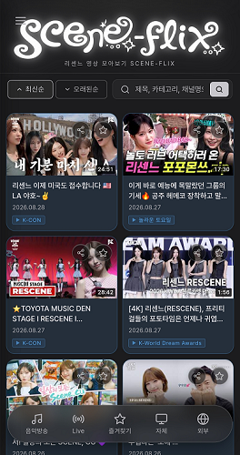

# 🎬 SCENE-FLIX

> **리센느(RESCENE) 팬 메이드 영상 모아보기 사이트**

대한민국의 걸그룹 **RESCENE(리센느)**의 음악방송, 자체 컨텐츠, Live, 외부 컨텐츠 등을 한곳에서 편리하게 볼 수 있는 팬 중심 아카이브 페이지입니다.

🌐 **[SCENE-FLIX 방문하기](https://adam-yam.github.io/SCENE-FLIX/)**

---

## ✨ 주요 기능

| 기능 | 설명 |
|------|------|
| 📺 **영상 통합 관리** | 음악방송, 자체 컨텐츠, Live, 외부 컨텐츠, Shorts 등을 카테고리별로 분류 |
| 🎯 **스마트 필터링** | 멤버별, 카테고리별, 업로드 순서별 필터링으로 원하는 영상을 쉽게 찾기 |
| 🌍 **다국어 지원** | 한국어(KR), 일본어(JP), 영어(EN) 지원 |
| 📅 **일정 관리** | Mnet Plus 기반 공식 스케줄 자동 갱신(6시간 주기) |
| 📊 **실시간 차트** | Melon, Spotify, Genie 등 다양한 플랫폼의 실시간 차트 데이터 |
| ⭐ **즐겨찾기** | 원하는 영상을 북마크하여 빠르게 접근 후 재생목록으로 재생가능 |
| 📱 **반응형 디자인** | PC, 태블릿, 모바일 모든 기기에서 최적화 |

---

## 📸 스크린샷

### 💻 PC 버전

### 📱 모바일 버전

---

## 🎯 카테고리

- **음악방송** - M Countdown, Show Champion, Music Bank 등 무대 영상
- **자체 컨텐츠** - 공식 채널 영상
- **Live** - 라이브 공연 및 무대
- **외부 컨텐츠** - 외부 채널 컨텐츠, 행사, 광고 등
- **Shorts** - 유튜브 쇼츠 영상
- **Charts** - 음원 플랫폼 별 차트
- **스케줄** - Mnet Plus를 기반으로한 스케줄
- **뉴스** - 리센느의 네이버 연예 기사 등

---

## 🛠️ 기술 스택

- **Frontend** - HTML, CSS, JavaScript
- **Data Management** - JSON 기반 영상 데이터
- **Automation** - GitHub Actions를 통한 자동 업데이트
- **PWA** - Service Worker, Manifest.json으로 오프라인 지원

### 디렉토리 구조
SCENE-FLIX/
├── index.html              # 메인 사이트 (단일 HTML 앱)
├── manifest.json            # PWA manifest
├── service-worker.js        # PWA 서비스 워커
├── image/                   # 로고, 아이콘, 이미지 등
├── data/                    # 크롤링된 데이터 (JSON)
│   ├── charts/               # 음원 차트 데이터
│   ├── schedule/              # 스케줄 데이터
│   ├── shorts.json            # 쇼츠 데이터
│   ├── news.json              # 뉴스 데이터
├── crawlers/                # 데이터 자동 수집 스크립트 (Python)
│   ├── crawl_chart.py         # 음원 플랫폼 차트 크롤링
│   ├── crawl_schedule.py      # 공식 스케줄 · 네이버 뉴스 크롤링
│   ├── crawl_shorts.py        # 공식/팬 채널 쇼츠 크롤링
│   └── requirements.txt
---

## 📋 라이선스 및 저작권

**이 페이지는 영리를 목적으로 하지 않으며, 광고 계획이 전혀 없습니다.**

각 영상의 저작권은 다음에게 있습니다:
- 🎵 각 음악방송 방송국
- 🏢 **더뮤즈 엔터테인먼트**
- 👯 **RESCENE(리센느)**

저작권자의 요청이 있을 경우, 해당 영상은 수정 또는 삭제될 수 있습니다.

---

## 📧 문의 및 피드백

**Email:** sceneflix.may@gmail.com

### 다음 사항들을 연락주세요:
- 🐛 **버그 제보** - 페이지 오류 및 오작동
- ➕ **영상 추가 요청** - 누락된 영상 등록
- ❌ **영상 삭제 요청** - 저작권 또는 기타 사유
- 💡 **건의사항** - 페이지 개선 의견
- 💌 **응원 메시지** - 제작자에게 전하고 싶은 말

---

© 2025 SCENE-FLIX · Fan-made, non-commercial · All rights belong to their respective owners
© The Muze Entertainment · © RESCENE
